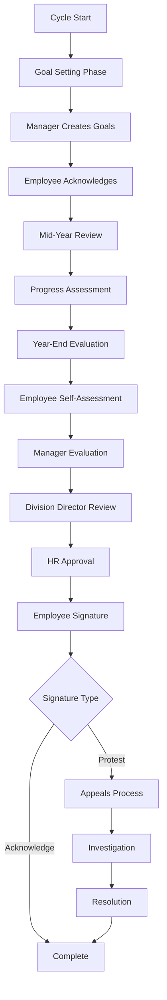

# Product Requirements Document: Smart Goals 360 Platform

## Introduction/Overview

Smart Goals 360 is a comprehensive employee performance management platform designed to streamline and digitize the entire performance lifecycle. The platform addresses the critical pain points of manual, paper-based performance review processes and lack of visibility into employee goals and progress by providing an integrated digital solution for HR administrators, managers, and employees.

The primary goal is to reduce HR administrative overhead while providing clear visibility into employee performance, goals, and organizational structure through automated workflows and centralized data management. The platform follows industry-standard performance appraisal methodologies (aligned with systems like PJIAE) and ensures compliance with labor agreements and audit requirements.

## Goals

1. **Eliminate Manual Processes**: Replace paper-based performance reviews with digital workflows that reduce administrative time by 60%
2. **Increase Goal Visibility**: Provide real-time visibility into employee goals, progress, and performance across all organizational levels
3. **Streamline Onboarding**: Reduce new organization setup time from weeks to hours through guided workflows
4. **Ensure Compliance**: Maintain comprehensive audit trails and digital signatures for all performance-related activities
5. **Improve User Experience**: Deliver an intuitive, role-based interface that requires minimal training
6. **Enable Appeals Process**: Provide structured workflows for employee feedback and formal appeals
7. **Support Multi-Tenant Architecture**: Ensure secure data isolation and customization for multiple organizations

## User Stories

### HR Administrator Stories

- As an HR Administrator, I want to quickly onboard new organizations by importing employee data and setting up organizational structure, so that I can get clients operational within hours instead of weeks
- As an HR Administrator, I want to configure appraisal cycles with multiple phases (goal setting, mid-year, year-end), so that performance reviews follow organizational standards and timelines
- As an HR Administrator, I want to manage competency libraries and goal templates, so that organizations can maintain consistency across appraisals
- As an HR Administrator, I want to track completion rates and generate compliance reports, so that I can ensure all appraisals meet regulatory requirements
- As an HR Administrator, I want to manage appeals workflows, so that employee disputes are handled systematically and documented

### Manager Stories

- As a Manager, I want to create and assign goals using templates, so that goal setting is efficient and consistent
- As a Manager, I want to conduct structured appraisals with competency evaluations and goal assessments, so that reviews are comprehensive and fair
- As a Manager, I want to track my team's appraisal progress and receive notifications about deadlines, so that I can ensure timely completion
- As a Manager, I want to provide detailed feedback and ratings with supporting comments, so that employees understand their performance evaluation

### Employee Stories

- As an Employee, I want to view my assigned goals and track my progress throughout the year, so that I understand my performance expectations
- As an Employee, I want to complete self-assessments and provide input during appraisals, so that my perspective is included in the evaluation
- As an Employee, I want to digitally sign my appraisal with options to acknowledge or dispute ratings, so that the process is official and my concerns are documented
- As an Employee, I want to initiate formal appeals if I disagree with my appraisal, so that I have recourse for unfair evaluations
- As an Employee, I want to access historical appraisals and goal records, so that I can track my career development over time

## Appraisal Cycle Management

### Cycle Structure

The system shall support configurable appraisal cycles (annual, biannual, or custom) with distinct phases:

**Phase 1: Goal Setting Period**

- Timing: Typically January-February for annual cycles
- Responsible Roles: Managers create goals, employees acknowledge
- Required Outputs: Completed goal forms with SMART criteria
- Approval Workflow: Manager → Division Director → HR (if required)

**Phase 2: Mid-Year Review (Optional)**

- Timing: Mid-point of appraisal cycle (June-July for annual)
- Responsible Roles: Managers and employees collaborate on progress assessment
- Required Outputs: Progress updates, revised goals if needed
- Approval Workflow: Manager → Employee acknowledgment

**Phase 3: Year-End Evaluation**

- Timing: End of appraisal cycle (November-December for annual)
- Responsible Roles: Employee self-assessment, manager evaluation
- Required Outputs: Completed appraisal forms with ratings and comments
- Approval Workflow: Employee self-assessment → Manager review → Division Director → HR → Employee signature

### Approval Workflows

Each appraisal phase follows a structured approval process:

1. **Initiation**: System automatically creates forms based on cycle configuration
2. **Primary Review**: Direct manager completes evaluation and submits for approval
3. **Secondary Review**: Division Director or designated reviewer approves/returns with comments
4. **HR Review**: HR validates compliance and completeness before final approval
5. **Employee Acknowledgment**: Employee reviews, provides feedback, and digitally signs
6. **Final Archive**: Completed appraisal is locked and archived with full audit trail

## Competency and Goal Frameworks

### Competency Library

The system shall provide:

- **Built-in Competency Library**: Default set of competencies with definitions, behavioral anchors, and 5-point rating scales
- **Role-Specific Competencies**: Competencies mapped to job roles and organizational levels
- **Custom Competency Creation**: Organizations can create, modify, and import their own competency frameworks
- **Competency Versioning**: Track changes to competency definitions with effective dates
- **Behavioral Anchors**: Detailed descriptions for each rating level (1-5) to ensure consistent evaluation

### Goal Templates and Management

- **Template Library**: Reusable goal templates categorized by department, role, or objective type
- **SMART Goal Framework**: Built-in validation to ensure goals are Specific, Measurable, Achievable, Relevant, Time-bound
- **Goal Cascading**: Link individual goals to departmental and organizational objectives
- **Template Versioning**: Track changes to goal templates with approval workflows
- **Best Practice Sharing**: Allow organizations to share successful goal templates across departments

### Scoring and Aggregation

- **Rating System**: 5-point scale (1=Below Expectations, 2=Partially Meets, 3=Meets, 4=Exceeds, 5=Outstanding)
- **Fractional Scores**: Support decimal ratings (e.g., 3.5) for more precise evaluation
- **Weighted Scoring**: Configure different weights for competencies vs. goals (e.g., 60% competencies, 40% goals)
- **Final Score Calculation**: Automated calculation with manual override capability for exceptional circumstances
- **Rating Distribution**: Track and report rating distributions to identify potential bias

## Employee Participation and Appeals

### Employee Feedback Process

- **Appraisal Comments**: Employees can add comments to any section of their appraisal
- **Self-Assessment**: Structured self-evaluation using the same competency framework
- **Goal Progress Updates**: Regular updates on goal achievement throughout the cycle
- **Feedback on Process**: Ability to provide feedback on the appraisal process itself

### Digital Signature Options

- **Acknowledge and Agree**: Standard acceptance of appraisal results
- **Acknowledge with Comments**: Accept ratings but provide additional context
- **Sign Under Protest**: Formal disagreement with evaluation while acknowledging receipt
- **Signature Methods**: Support typed signatures, drawn signatures, and external e-signature integration

### Appeals Workflow

1. **Appeal Initiation**: Employee submits formal appeal within 30 days of appraisal completion
2. **Documentation**: System captures specific areas of disagreement and supporting evidence
3. **Initial Review**: HR reviews appeal for completeness and validity
4. **Investigation**: Designated reviewer (not involved in original appraisal) investigates claims
5. **Resolution**: Appeal outcome documented with rationale and any corrective actions
6. **Final Decision**: Employee notified of decision with option for further escalation per organizational policy

## Digital Signatures and Document Management

### Signature Capabilities

- **Signature Types**: Support typed names, drawn signatures, and integration with DocuSign/Adobe Sign
- **Legal Compliance**: Ensure signatures meet legal requirements for employment documents
- **Multi-Party Signing**: Sequential signing workflow (employee → manager → HR)
- **Signature Validation**: Verify signature authenticity and prevent tampering

### Document Export and Archiving

- **PDF Export**: Generate complete appraisal documents as immutable PDFs
- **Version Control**: Maintain complete history of document changes with timestamps
- **Bulk Export**: Export multiple appraisals for compliance audits
- **Long-term Archival**: Retain documents per organizational retention policies (typically 7+ years)
- **Search and Retrieval**: Full-text search across archived documents

## Access Control and Security

### Role-Based Permissions

**HR Administrator**

- Full system access and configuration
- View all employee data and appraisals
- Manage user accounts and permissions
- Generate system-wide reports

**Division Director/Senior Manager**

- View appraisals for entire division
- Approve appraisals from direct reports
- Access divisional reporting and analytics
- Manage appraiser assignments within division

**Manager/Supervisor**

- Create and manage goals for direct reports
- Conduct appraisals for assigned employees
- View team performance dashboards
- Access employee development resources

**Employee**

- View own goals, appraisals, and development plans
- Complete self-assessments and provide feedback
- Access historical performance records
- Initiate appeals process

### Advanced Security Features

- **Single Sign-On (SSO)**: Integration with organizational identity providers
- **Multi-Factor Authentication**: Optional 2FA for sensitive operations
- **Delegated Access**: Temporary access delegation during absences
- **Audit Logging**: Comprehensive logging of all user actions and data access
- **Data Encryption**: Encryption at rest and in transit for all sensitive data

## Multi-Tenant Architecture and Customization

### Tenant Isolation

- **Data Segregation**: Complete isolation of data between organizations
- **Custom Domains**: Optional custom domain support for white-label deployments
- **Backup Isolation**: Separate backup and recovery processes per tenant
- **Performance Isolation**: Resource allocation to prevent cross-tenant performance impact

### Customization Options

- **Branding**: Custom logos, colors, and terminology per organization
- **Workflow Configuration**: Customize approval workflows and cycle timing
- **Field Customization**: Add custom fields to appraisal forms
- **Notification Templates**: Customize email templates and notification content
- **Reporting Customization**: Custom report templates and dashboards

## Integration and Data Management

### Future HRIS Integration (Phase 2)

- **Standard APIs**: RESTful APIs for employee data synchronization
- **Data Mapping**: Flexible field mapping between systems
- **Real-time Sync**: Automatic updates when employee data changes
- **Supported Systems**: Workday, BambooHR, ADP, and other major HRIS platforms
- **Data Ownership**: Clear data ownership and portability agreements

### Data Privacy and Compliance

- **Data Residency**: Configurable data storage location per regulatory requirements
- **GDPR Compliance**: Right to access, rectify, and delete personal data
- **Data Retention**: Configurable retention policies with automatic purging
- **Privacy Controls**: Granular privacy settings for sensitive information
- **Compliance Reporting**: Built-in reports for regulatory compliance

## Reporting and Analytics

### Standard Reports (MVP)

- **Completion Tracking**: Real-time appraisal completion rates by department/division
- **Overdue Notifications**: Automated alerts for overdue appraisals and goals
- **Rating Distribution**: Analysis of rating patterns to identify potential bias
- **Goal Achievement**: Tracking of goal completion rates and success metrics
- **Appeals Summary**: Summary of appeals filed and resolution outcomes

### Advanced Analytics (Future Phase)

- **Performance Trends**: Multi-year performance trend analysis
- **Predictive Analytics**: Identify at-risk employees and high performers
- **Calibration Reports**: Support for calibration meetings and rating consistency
- **Custom Dashboards**: Configurable dashboards for different organizational levels
- **Export Capabilities**: Export data to external analytics tools

## Notification System and Change Management

### Notification Framework

- **Trigger Events**: Configurable notifications for key events (assignments, deadlines, approvals)
- **Multi-Channel**: Email, in-app notifications, and optional SMS integration
- **User Preferences**: Individual notification preferences and frequency settings
- **Escalation Rules**: Automatic escalation for overdue items
- **Digest Options**: Daily/weekly summary notifications

### Version History and Change Tracking

- **Document Versioning**: Complete version history for all appraisals and goals
- **Change Tracking**: Detailed audit trail of who changed what and when
- **Rollback Capability**: Ability to revert to previous versions if needed
- **Change Notifications**: Notify relevant parties when documents are modified
- **Approval Re-routing**: Re-route approvals when significant changes are made

## User Experience and Onboarding

### Guided Onboarding

- **Organization Setup Wizard**: Step-by-step setup for new organizations
- **User Onboarding**: Role-specific tutorials and getting started guides
- **Progress Tracking**: Visual indicators showing setup completion status
- **Best Practices**: Built-in recommendations and industry best practices
- **Sample Data**: Optional sample data to demonstrate platform capabilities

### Contextual Help and Support

- **In-line Help**: Contextual tooltips and help text throughout the interface
- **Video Tutorials**: Embedded video guides for complex processes
- **Knowledge Base**: Searchable help documentation
- **Custom Help Content**: Organizations can add their own help resources
- **Support Ticketing**: Built-in support request system

## Functional Requirements

### Authentication & Authorization

1. The system must provide secure user authentication with role-based access control
2. The system must support granular permissions beyond basic HR/Manager/Employee roles
3. The system must integrate with Single Sign-On (SSO) providers
4. The system must support multi-factor authentication for sensitive operations
5. The system must maintain session security with configurable timeout periods

### Organization Onboarding

6. The system must provide guided setup wizards for new organizations
7. The system must support CSV import with field mapping and validation
8. The system must allow manual employee entry with bulk operations
9. The system must enable organizational structure creation with unlimited hierarchy levels
10. The system must support role assignment with custom role definitions

### Appraisal Cycle Management

11. The system must allow configuration of multiple appraisal cycles (annual, biannual, custom)
12. The system must support phase-based workflows (goal setting, mid-year, year-end)
13. The system must enforce cycle deadlines with automated notifications
14. The system must provide cycle templates for quick setup
15. The system must track cycle completion rates and generate progress reports

### Goal Management

16. The system must provide goal templates with SMART criteria validation
17. The system must support goal cascading from organizational to individual levels
18. The system must allow goal assignment to individuals and groups
19. The system must track goal progress with regular update capabilities
20. The system must provide goal achievement analytics and reporting

### Competency Framework

21. The system must include a built-in competency library with behavioral anchors
22. The system must support role-specific competency assignments
23. The system must allow custom competency creation and modification
24. The system must maintain competency versioning with effective dates
25. The system must provide competency mapping tools for organizational alignment

### Performance Appraisals

26. The system must support structured appraisal workflows with multiple evaluation steps
27. The system must provide both self-assessment and manager evaluation capabilities
28. The system must calculate weighted scores based on competencies and goals
29. The system must support fractional ratings (decimal scores)
30. The system must maintain rating distribution analytics

### Digital Signatures and Documentation

31. The system must support multiple signature types (typed, drawn, e-signature integration)
32. The system must provide signature options (acknowledge, comment, protest)
33. The system must generate immutable PDF documents of completed appraisals
34. The system must maintain complete version history of all documents
35. The system must support bulk document export for compliance

### Employee Feedback and Appeals

36. The system must allow employee comments on all appraisal sections
37. The system must provide structured appeals workflow with tracking
38. The system must support appeal documentation and evidence attachment
39. The system must notify relevant parties of appeal status changes
40. The system must maintain appeals history and resolution records

### Reporting and Analytics

41. The system must provide real-time completion tracking dashboards
42. The system must generate overdue notifications and escalation alerts
43. The system must analyze rating distributions for bias detection
44. The system must track goal achievement rates and success metrics
45. The system must support custom report generation and scheduling

### Data Management and Security

46. The system must ensure complete data isolation between organizations
47. The system must provide comprehensive audit trails for all user actions
48. The system must support configurable data retention policies
49. The system must comply with GDPR and other privacy regulations
50. The system must provide secure data backup and recovery capabilities

### Integration and Extensibility

51. The system must provide RESTful APIs for future HRIS integration
52. The system must support webhook notifications for external systems
53. The system must allow custom field additions to standard forms
54. The system must support data export in multiple formats (CSV, Excel, PDF)
55. The system must provide integration capabilities with e-signature providers

### Notification and Communication

56. The system must support multi-channel notifications (email, in-app, SMS)
57. The system must allow user customization of notification preferences
58. The system must provide automated escalation for overdue items
59. The system must support notification templates and customization
60. The system must track notification delivery and engagement

## Non-Goals (Out of Scope)

The Smart Goals 360 platform will **NOT** include:

1. **Payroll Integration**: No salary, bonus, or compensation management features
2. **Learning & Development**: No training modules, course management, or skill development tracking
3. **Recruitment & Hiring**: No job posting, candidate management, or hiring workflow features
4. **Time & Attendance**: No time tracking, attendance monitoring, or leave management
5. **Advanced Analytics**: No predictive analytics or machine learning capabilities (Phase 1)
6. **Native Mobile Apps**: No iOS/Android applications (responsive web interface only)
7. **Social Features**: No social networking, peer recognition, or collaboration tools
8. **Document Management**: No general document storage beyond appraisal-related documents
9. **Project Management**: No task tracking or project management capabilities
10. **Financial Reporting**: No budget tracking or financial performance metrics

## Design Considerations

### User Interface Framework

- **Technology Stack**: React 18 with TypeScript and shadcn/ui component library
- **Design System**: Consistent design tokens, typography, and component patterns
- **Responsive Design**: Mobile-first approach with seamless desktop, tablet, and mobile experience
- **Accessibility**: WCAG 2.1 AA compliance with keyboard navigation and screen reader support
- **Dark Mode**: Optional dark theme support for user preference

### User Experience Principles

- **Progressive Disclosure**: Show relevant information based on user role and context
- **Guided Workflows**: Step-by-step processes with clear progress indicators
- **Contextual Help**: In-line assistance and tooltips throughout the interface
- **Error Prevention**: Validation and confirmation dialogs to prevent user errors
- **Performance**: Fast loading times with optimized data fetching and caching

## Technical Considerations

### Architecture

- **Frontend**: React 18 with TypeScript, Vite build system, Tailwind CSS styling
- **Backend**: Supabase (PostgreSQL database with real-time capabilities and authentication)
- **Database**: PostgreSQL with row-level security and structured schemas
- **File Storage**: Secure document storage with encryption and access controls
- **Caching**: Redis caching layer for improved performance

### Security and Compliance

- **Data Encryption**: AES-256 encryption at rest and TLS 1.3 in transit
- **Access Controls**: Row-level security policies and role-based permissions
- **Audit Logging**: Comprehensive logging of all user actions and data changes
- **Backup Strategy**: Automated daily backups with point-in-time recovery
- **Compliance**: SOC 2 Type II, GDPR, and industry-specific compliance requirements

### Performance and Scalability

- **Optimization**: Support for organizations with up to 500 employees (Phase 1)
- **Database Indexing**: Optimized queries and database indexes for performance
- **Caching Strategy**: Application-level caching for frequently accessed data
- **CDN Integration**: Content delivery network for static assets
- **Monitoring**: Application performance monitoring and alerting

## Success Metrics

### Primary Metrics

1. **Administrative Time Reduction**: Achieve 60% reduction in time spent on performance review administration
2. **Process Completion Rate**: Maintain 90% appraisal completion rate within established deadlines
3. **Goal Visibility**: Ensure 95% of employees have clearly defined, trackable goals
4. **User Adoption**: Achieve 85% active user engagement across all user roles within 6 months

### Secondary Metrics

5. **Data Accuracy**: Reduce data entry errors by 75% compared to manual processes
6. **Appeal Resolution**: Resolve 90% of appeals within 30 days of submission
7. **User Satisfaction**: Maintain user satisfaction score of 4.0+ out of 5.0
8. **System Uptime**: Achieve 99.5% system availability during business hours
9. **Support Efficiency**: Reduce support tickets related to performance management by 50%
10. **Compliance**: Maintain 100% compliance with audit requirements and data retention policies

## Implementation Phases

### Phase 1: Core Platform (Months 1-6)

- Basic authentication and user management
- Organization onboarding and employee import
- Goal creation and assignment
- Basic appraisal workflows
- Digital signatures and document export

### Phase 2: Advanced Features (Months 7-12)

- Appeals workflow and employee feedback
- Advanced reporting and analytics
- HRIS integration capabilities
- Custom competency frameworks
- Enhanced notification system

### Phase 3: Enterprise Features (Months 13-18)

- Advanced customization options
- Predictive analytics and insights
- Mobile application development
- Third-party integrations
- Advanced compliance features

## Appendices

### Sample Appraisal Workflow Diagram

### Policy Template References

Organizations implementing Smart Goals 360 should reference the following policy templates:

- Employee Performance Management Policy
- Appeals and Grievance Procedures
- Data Privacy and Retention Policy
- Digital Signature and Document Management Policy
- Competency Framework and Rating Guidelines

### Sample Competency Framework

**Leadership Competency Example:**

- **Definition**: Demonstrates ability to guide, motivate, and develop others
- **Level 1 (Below Expectations)**: Rarely takes initiative or provides direction
- **Level 2 (Partially Meets)**: Occasionally provides guidance with prompting
- **Level 3 (Meets Expectations)**: Consistently provides clear direction and support
- **Level 4 (Exceeds Expectations)**: Proactively develops others and drives results
- **Level 5 (Outstanding)**: Exceptional leader who inspires and transforms teams

---

_This comprehensive PRD serves as the definitive guide for developing the Smart Goals 360 platform. It should be reviewed quarterly and updated as requirements evolve and stakeholder feedback is incorporated._
